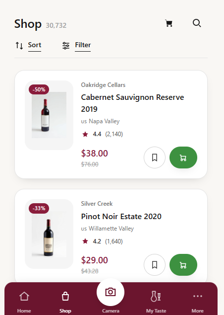

# Vivino Clone

> Pixel-perfect clone of the Vivino wine app, built to study the engineering behind deceptively simple nested scroll interfaces.



**Live:** [lubakaper.github.io/VivinoVersion2](https://lubakaper.github.io/VivinoVersion2/#/shop)

## The Problem

Consumer apps like Vivino look effortless, but their interfaces hide serious layout complexity. Nested scrolling — where an outer page and inner panel scroll independently — is one of those patterns that feels invisible when it works and broken when it doesn't. Understanding how these patterns are built is essential for frontend developers who want to move beyond tutorials.

## What It Does

A pixel-perfect desktop clone of Vivino's wine browsing interface with independently scrolling nested panels. The outer page scrolls normally while the inner wine list panel scrolls within its own container, matching the real app's behavior.

## Key Features

| Feature | Description |
|---------|-------------|
| Nested Scroll Architecture | Outer page and inner wine list panels scroll independently using carefully managed CSS overflow |
| Pixel-Perfect UI | Matched Vivino's layout, typography, spacing, and visual hierarchy from the production app |
| Wine Browse View | Scrollable wine listings with ratings, prices, and bottle images |
| Shop Navigation | Multi-section shop layout with category filtering |

## Tech Stack

| Layer | Tech | Why |
|-------|------|-----|
| Frontend | React, Vite | Component architecture for reusable wine card and layout components |
| Styling | Tailwind CSS | Utility classes enabled precise pixel matching during the clone process |
| Routing | React Router | Hash-based routing for the shop/browse navigation |

## Technical Decisions

- **CSS overflow isolation over JavaScript scroll hijacking** — JavaScript scroll listeners cause jank and fight the browser's native behavior. Using `overflow-y: auto` on the inner panel and `overflow-x: clip` on the body (scoped via `:has()`) lets the browser handle both scroll contexts natively with zero JS.
- **Fixed sticky layout via body `overflow-x: clip` scoped with `:has()`** — the two-column desktop layout requires the left panel to stay fixed while the right panel scrolls. Rather than adding scroll listeners, the CSS `:has()` selector scopes the overflow clip to only activate when the sticky layout is present, keeping it contained.

## Getting Started

```bash
git clone https://github.com/jonelrichardson-spec/vivino-clone.git
cd vivino-clone
npm install
npm run dev
```

## What I'd Build Next

- Wine detail modal with tasting notes and food pairing suggestions
- Search and filter by grape variety, region, and price range
- Mobile-responsive version that adapts the nested scroll to a single-column layout

## About This Project

Built during Pursuit's AI-Native Builder Fellowship (February 2026) with teammate Luba.

**My role:** Built the full UI clone including the nested scroll architecture, wine card components, and shop layout. Luba contributed to the wine data and browse view.

---

Built by [Jonel Richardson](https://linkedin.com/in/jonel-richardson-09a399382)
